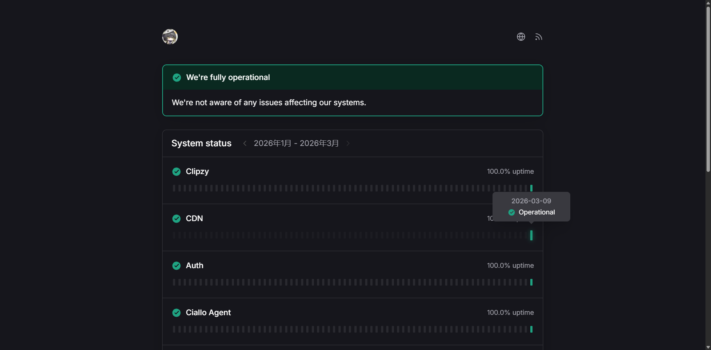

# Checkly Status Template

[](https://vercel.com/new/clone?repository-url=https://github.com/shuakami/checkly-status-template&env=CHECKLY_API_KEY,CHECKLY_ACCOUNT_ID&envDescription=Checkly%20API%20credentials%20for%20your%20status%20page&project-name=checkly-status-template)

A production-ready Next.js status page template for teams that already use Checkly and want a polished public status site without rebuilding the basics.



## Why This Template

- Built on Next.js 16 and React 19 with Cache Components enabled
- Connects directly to Checkly checks, statuses, results, and analytics
- Includes a public status page, RSS feed, JSON API route, and dynamic favicon badge
- Keeps outage history opinionated but configurable so short-lived noise does not overwhelm the page
- Centralizes branding, thresholds, time zone settings, and link-visibility rules in one typed config file
- Falls back to a friendly maintenance notice when Checkly env vars are missing or the upstream API is temporarily unavailable
- Ships with a default `vercel.json` that raises App Router function timeouts to 30 seconds

## Quick Start

1. Create a repository from this template.
2. Install dependencies.

```bash
npm install
```

3. Copy the environment example.

```bash
cp .env.example .env.local
```

4. Create a Checkly API key at [Checkly User API Keys](https://app.checklyhq.com/settings/user/api-keys), then fill in your Checkly credentials in `.env.local`.

```env
CHECKLY_API_KEY="cu_your_checkly_api_key"
CHECKLY_ACCOUNT_ID="your-checkly-account-id"
```

5. Open `lib/site-config.ts` and update the brand, website URL, time zone, thresholds, and optional service overrides.
6. Replace the logo asset in `public/` if you do not want the default mark.
7. Start the development server.

```bash
npm run dev
```

8. Validate the build before deploying.

```bash
npm run validate
```

## Configuration

### `lib/site-config.ts`

This file is the main customization surface.

- `brand`: site name, short name, website URL, logo asset, and footer text
- `monitoring`: display time zone, history window length, incident thresholds, cache timings, and external-link hiding rules
- `services.nameOverrides`: rename noisy or internal Checkly check names without touching the data layer
- `copy.headlines`: customize the hero state copy for operational, degraded, outage, and maintenance states

### Incident Thresholds

The default behavior is intentionally conservative:

- degraded time under 30 minutes does not show in History
- outage time under 5 minutes does not show in History
- days with less than 30 minutes of total impact still render as operational

All of those rules live in `siteConfig.monitoring`.

### External Links

Some teams want service cards for internal workers or CDN checks but do not want to expose those URLs publicly. Use:

- `hiddenExternalLinkKeywords`
- `hiddenExternalLinkFragments`

to keep those cards visible while suppressing the outbound link icon.

## Scripts

- `npm run dev`: start the Next.js development server
- `npm run build`: build for production
- `npm run start`: run the production server
- `npm run typecheck`: run TypeScript checks
- `npm run validate`: run type checks and a production build

## Deployment

This template works well on Vercel, Fly.io, Render, or any Node host that can run `next start`.

### Vercel

- Use the deploy button at the top of this README for a one-click setup
- Add `CHECKLY_API_KEY` and `CHECKLY_ACCOUNT_ID` in your Vercel project environment variables
- `CHECKLY_API_KEY` can be created from [Checkly User API Keys](https://app.checklyhq.com/settings/user/api-keys)
- The included `vercel.json` raises the default App Router function timeout to 30 seconds
- Keep `cacheComponents` enabled and deploy after `npm run validate`

## How It Works

- `app/`: routes, RSS feed, JSON API, metadata icon, and the page entrypoint
- `components/`: the interactive client-side status page
- `lib/checkly.ts`: Checkly fetching, caching, incident grouping, and uptime shaping
- `lib/site-config.ts`: brand and behavior configuration

## License

MIT. See `LICENSE`.
